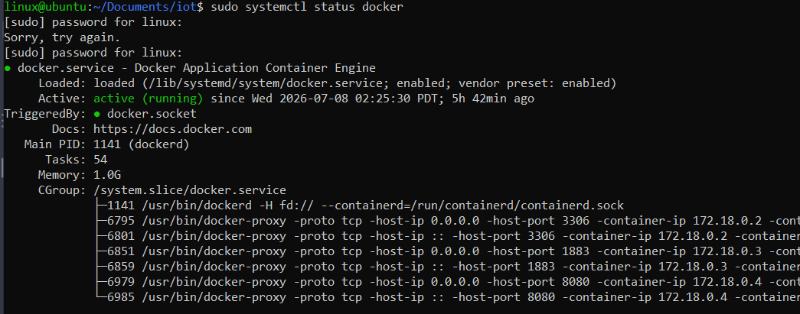
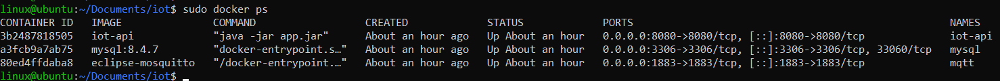
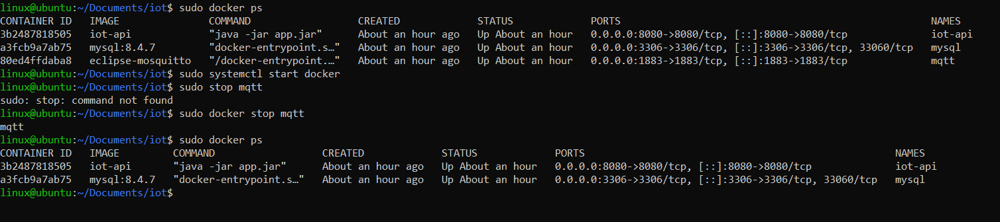
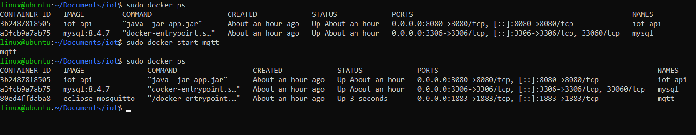
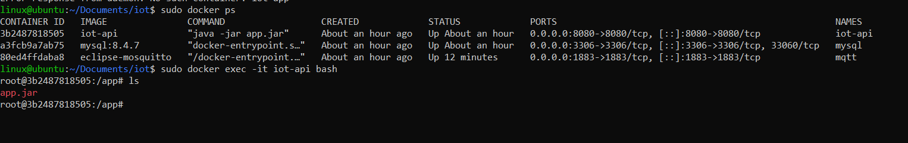
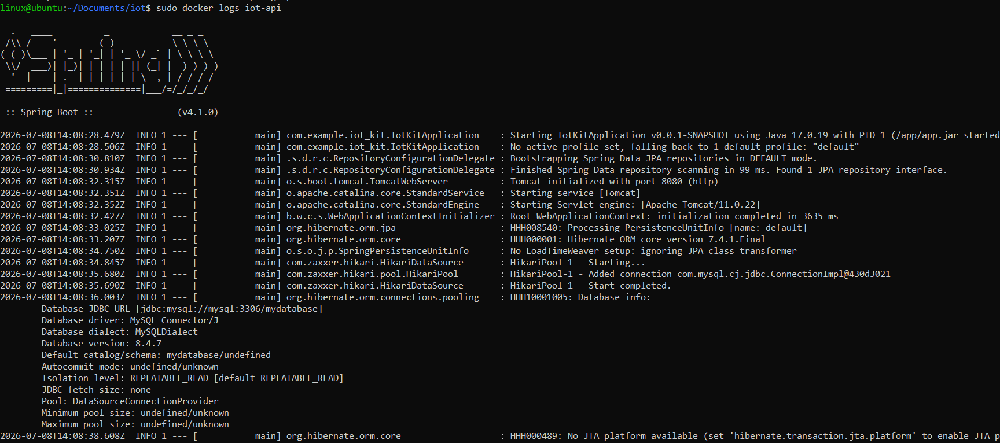
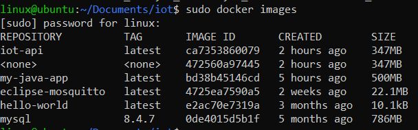
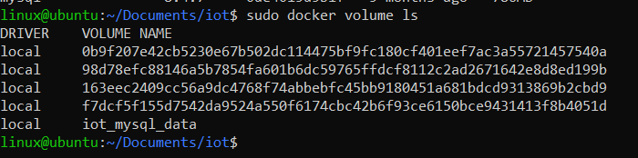
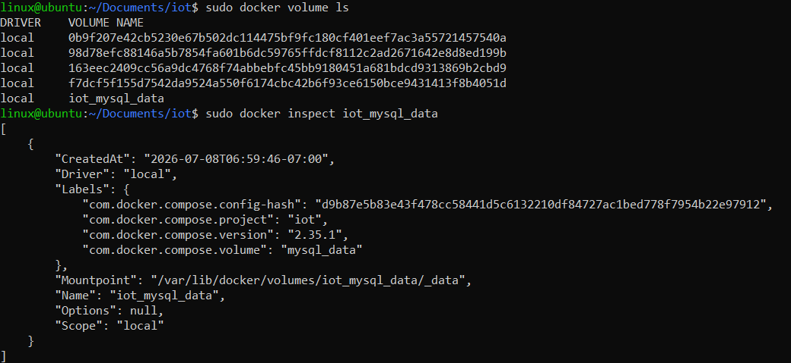
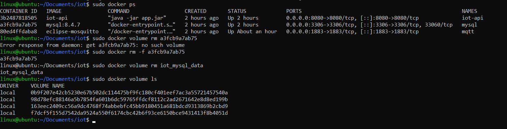

# Docker Instruction 


## What is Docker ?

Docker is tool used to package applications
and their runtime environments into a unit called a container.A container hold the Code, Librarie, Runtime, Configuration, Etc., Allowing the application to run identically on the development machine, linux server or VPS.

### Example:
Instead of installing manually:

```Bash
Ubuntu
- Java 17
- MySQL
- Mosquitto
- app.jar
```

You can  use Docker:

```Bash
Ubuntu
    Docker
        Container Spring Boot
            app.jar
        Container MySQL
            database
        Container MQTT
            Mosquitto

```

## Docker basic concepts
- Image 
- Container

### Image
An image is the "buleprint" for creating a container.

Example:
```Bash
mysql:8
openjdk:17
eclipse-mosquitto
ubuntu:20.04
```
It can be understood as follows:
```Bash
Class Java --> Object
Image      --> Container
```

### Container
Container is program running from Image:

Example:

Install image MySQL:
```Bash
docker pull mysql:8
```
Creating container:
```Bash
docker run  mysql:8
```

Result:
```Bash
Image mysql:8

        |
        v

Container mysql
(running)
```

## Install Docker Ubuntu 20.04

**Update**
```Bash
sudo apt update
```
**Install Docker**
```Bash
sudo apt install ca-certificates curl
sudo install -m 0755 -d /etc/apt/keyrings
sudo curl -fsSL https://download.docker.com/linux/ubuntu/gpg -o /etc/apt/keyrings/docker.asc
sudo chmod a+r /etc/apt/keyrings/docker.asc

# Add the repository to Apt sources:
sudo tee /etc/apt/sources.list.d/docker.sources <<EOF
Types: deb
URIs: https://download.docker.com/linux/ubuntu
Suites: $(. /etc/os-release && echo "${UBUNTU_CODENAME:-$VERSION_CODENAME}")
Components: stable
Architectures: $(dpkg --print-architecture)
Signed-By: /etc/apt/keyrings/docker.asc
EOF

sudo apt update
```

**Install the Docker packages**
```Bash
sudo apt install docker-ce docker-ce-cli containerd.io docker-buildx-plugin docker-compose-plugin
```

https://docs.docker.com/engine/install/ubuntu/

**Verify Docker version**

```Bash
docker --version
```
**Check docker run:**

```Bash
sudo systemctl status docker
```

output:


**Start Docker**

```Bash
sudo systemctl start docker
```
**It runs automatically when the machine**
```Bash
sudo systemctl enable docker
```


## Manage Container

**Watch the container in motion**
```Bash
sudo docker ps
sudo docker ps -a //watch all
```
output:


**Stop container**
```Bash
sudo docker stop <name>
```
example:
```Bash
sudo docker stop mqtt
```
output:


**Run Container**
```Bash
docker start <name>
```

example:
```Bash
sudo docker start mqtt
```
output:

**Restart container**
```Bash
sudo docker restart <name>
```
**Delete container**
\
Before deleteting the container, you need to turn it off.
```Bash
sudo docker stop <name>
```
Delete:

```Bash
sudo docker rm <name>
```

**Inside the container**

```Bash
sudo docker exec -it <name> bash
```
example:


```
Ctrl+D // exit
```

**Watch Container** 
```Bash
sudo docker logs <name>
sudo docker logs -f <name> //watch realtime
sudo docker logs --tail 1000 <name> //watch the last 100 line
```
example: "sudo docker logs iot-api"


## Manage Image

The image is the same as the installation file.

**Watch docker**
```Bash
sudo docker images
```
output:



**install Image**
```Bash
sudo docker pull mysql:8
```
**delete Image**
```Bash
sudo docker rmi mysql:8
```
## Manage volume

Volume contain data.
**Watch Volume**
```Bash
sudo docker volume ls
```
example:

**Watch details**

```Bash
sudo docker volume inspect <VOLUME NAME>

```
example:

**Delete volume**

Before delete volume , you need delete container

```Bash
sudo docker volume rm <VOLUME NAME>
```
example:

